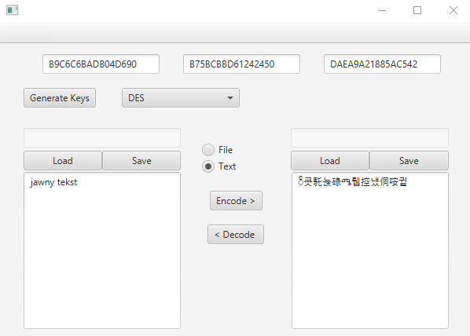

<h3 align="center">

<pre>
  _____  ______  _______   __  ______                     _           
 |  __ \|  ____|/ ____\ \ / / |  ____|                   | |          
 | |  | | |__  | (___  \ V /  | |__   _ __   ___ ___   __| | ___ _ __ 
 | |  | |  __|  \___ \  > <   |  __| | '_ \ / __/ _ \ / _` |/ _ | '__|
 | |__| | |____ ____) |/ . \  | |____| | | | (_| (_) | (_| |  __| |   
 |_____/|______|_____//_/ \_\ |______|_| |_|\___\___/ \__,_|\___|_|   
                                                                      
                                                                      
</pre>

</h3>

## Overview

This project Java-based application with a JavaFX GUI designed to encode and decode text using the DESX encryption algorithm. The app provides an interface where users can input plaintext or load file, encrypt it into ciphertext, or decrypt ciphertext back to its original form. Key features include input fields for text and encryption keys, buttons for loading files, buttons for encoding/decoding, and a display area for results.

This project was created for "Foundations of Cryptography" course on Technical University of Lodz.

## License

GPL-2.0

